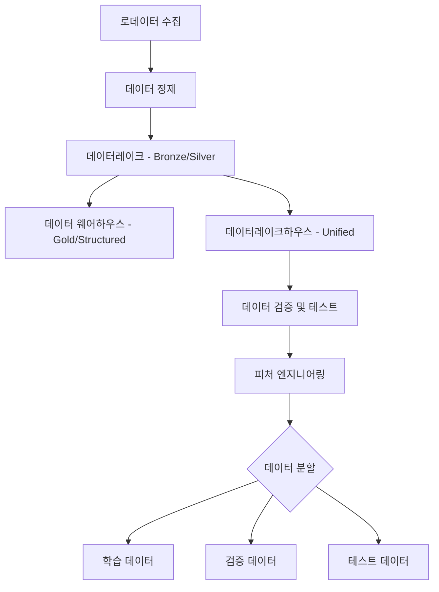

# MLOps 파이프라인 가이드

이 문서는 MLOps를 진행할 때의 데이터 파이프라인과 모델 파이프라인의 순서를 설명합니다.

## 1. 데이터 파이프라인 (Data Pipeline)

데이터 파이프라인은 로우 데이터가 수집되어 학습 가능한 형태로 변환되고 저장되는 과정을 담고 있습니다.

### 상세 단계
1. **로데이터 수집 (Raw Data Collection)**: 다양한 소스(DB, API, 로그 등)로부터 원천 데이터를 수집합니다.
2. **정제 (Refining/Cleaning)**: 결측치 처리, 이상치 제거, 데이터 형식 통일 등을 수행합니다.
3. **데이터레이크 (Data Lake)**: 정제된 데이터를 원본 형태에 가깝게 대량으로 저장합니다 (Bronze/Silver 계층).
4. **데이터 웨어하우스 (Data Warehouse)**: 분석과 보고를 위해 구조화된 데이터를 저장합니다.
5. **데이터레이크하우스 (Data Lakehouse)**: 데이터레이크의 유연성과 웨어하우스의 관리 기능을 결합하여 ML 및 데이터 분석에 최적화된 통합 환경을 제공합니다.
6. **데이터 검증 및 테스트 (Data Validation & Unit Test)**: 피처를 만들기 전, 데이터의 스키마, 분포, 결측치 비율 등을 테스트하여 데이터 품질을 보장합니다. (예: Great Expectations 사용)
7. **피처 엔지니어링 (Feature Engineering)**: 모델이 학습하기 적합한 피처(Feature)를 생성 및 선택합니다.
8. **데이터 분할 (Data Splitting)**: 데이터를 Training, Validation, Test 세트로 나눕니다.

---

## 2. 모델 파이프라인 (Model Pipeline)

모델 파이프라인은 준비된 데이터를 바탕으로 모델을 학습시키고 테스트 및 배포하는 과정입니다.

### 모델 파이프라인 순서
1. **모델 설계 및 구현**: 알고리즘 선정 및 아키텍처 정의.
2. **모델 학습 (Model Training)**: **학습 데이터(Training Data)**를 사용하여 모델 파라미터를 최적화합니다.
3. **하이퍼파라미터 튜닝**: 성능을 극대화하기 위해 최적의 파라미터 조합을 찾습니다.
4. **모델 검증 (Model Validation)**: **검증 데이터(Validation Data)**를 사용하여 학습 중 과적합 여부를 확인하고 모델 선택의 기준으로 삼습니다.
5. **모델 테스트 및 최종 평가 (Model Testing)**: **테스트 데이터(Test Data)**를 사용하여 최종 선택된 모델의 일반화 성능을 독립적으로 측정합니다. (학��에 전혀 관여하지 않은 데이터로 최종 성능 확인)
6. **모델 등록 (Model Registry)**: 테스트를 통과한 모델을 버전별로 저장소에 등록합니다.
7. **서빙 및 배포 (Model Serving/Deployment)**: 실시간 또는 배치 처리를 위해 모델을 프로덕션 환경에 배포합니다.
8. **모니터링 (Monitoring)**: 배포된 모델의 성능(Drift 등)을 지속적으로 모니터링하고 재학습 여부를 결정합니다.